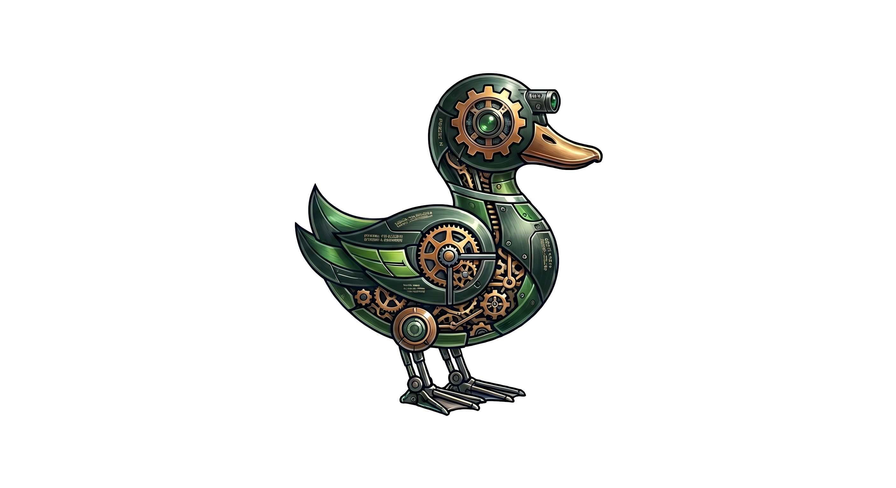
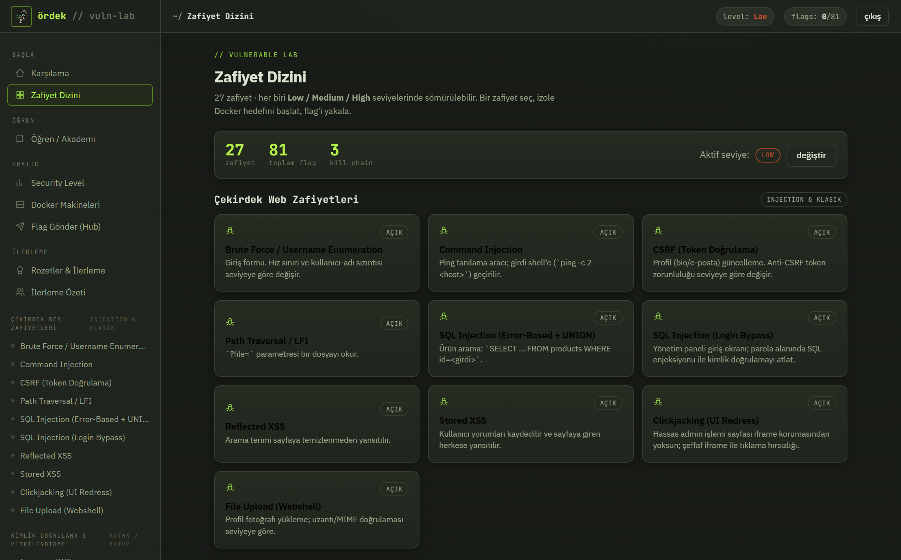
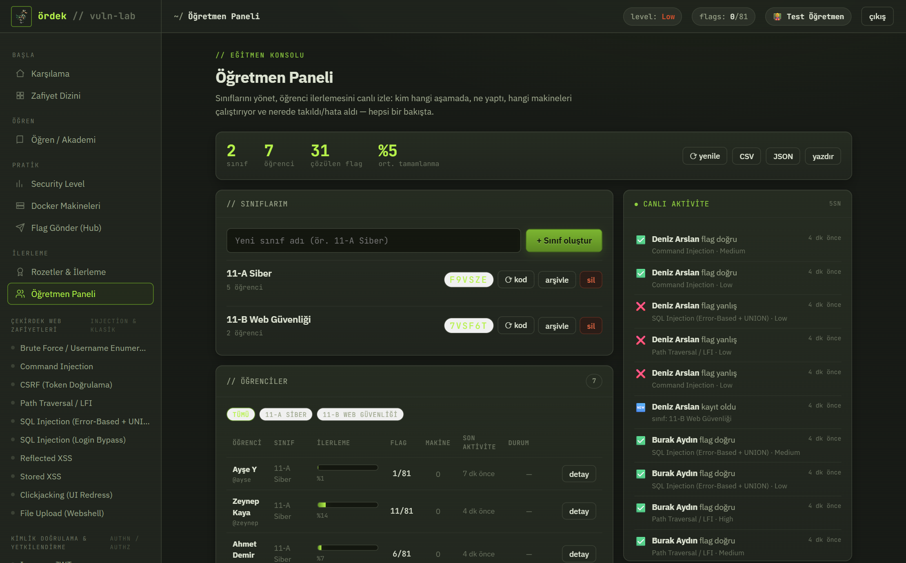
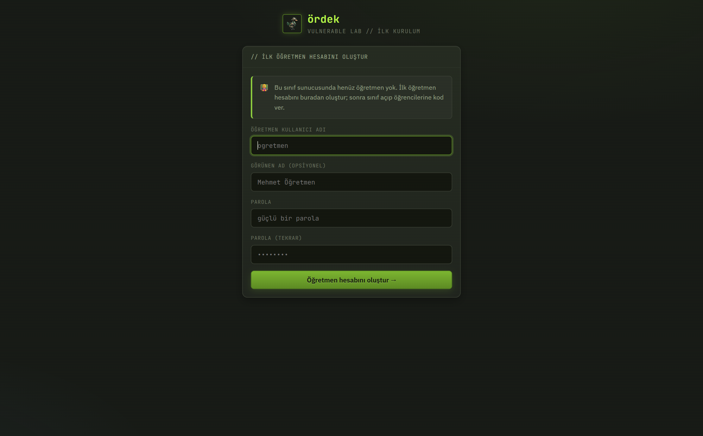
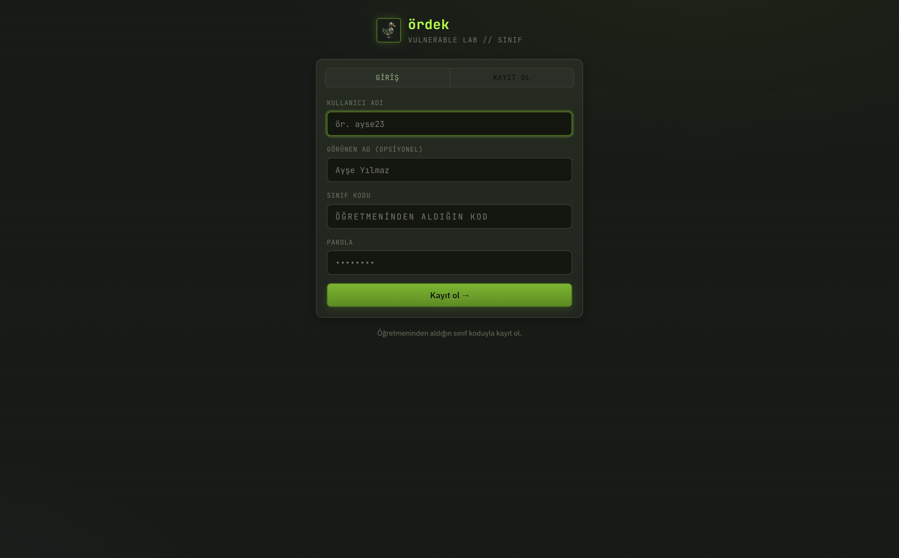
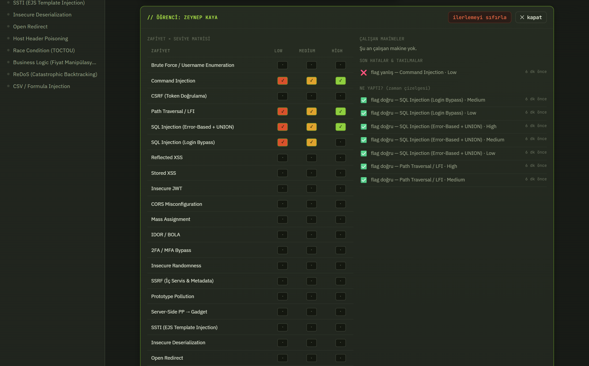
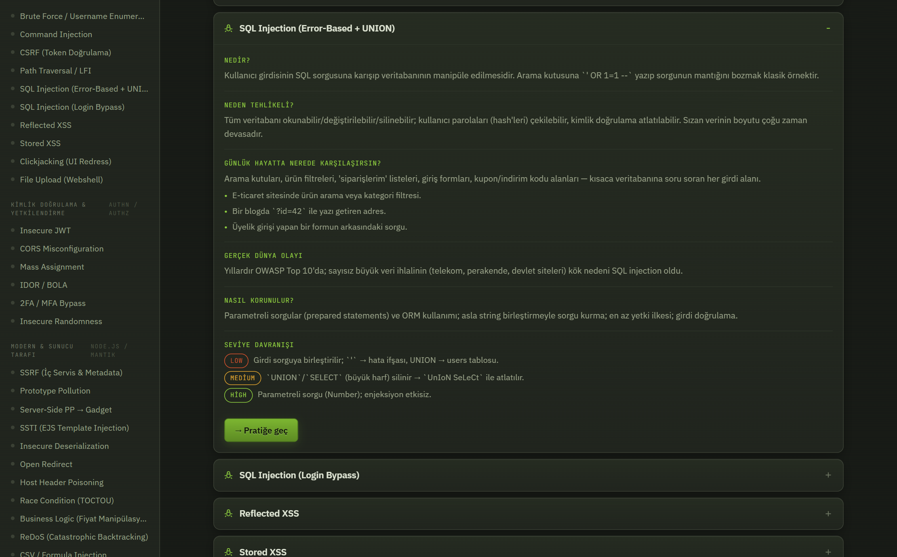
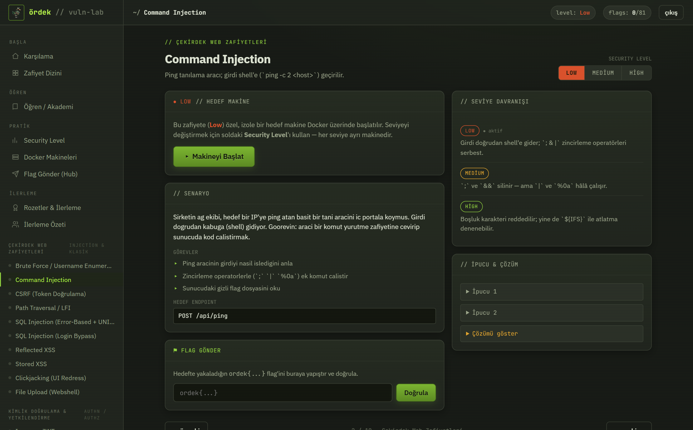

<div align="center">



# ördek-lab

**Gerçekten sömürülebilir, TryHackMe tarzı bir web güvenliği laboratuvarı — öğretmen paneli ve sınıf modu ile.**
<br/>
<sub>An intentionally vulnerable, hands-on web security lab with a live teacher dashboard & classroom mode.</sub>

<br/>

[](https://github.com/er0s3c/ordek)


</div>

> ⚠️ **Kasıtlı olarak zafiyetlidir. Asla internete açmayın.** Yalnızca izole/lokal ağda ve
> yetkili eğitim ortamında çalıştırın. Ayrıntı için [SECURITY.md](SECURITY.md).

---

ördek-lab; **27 web zafiyetini** her biri **Low / Medium / High** olmak üzere üç ayrı zorlukta,
**gerçek backend'e karşı** sömürebileceğin bir laboratuvardır. Her zafiyet izole bir **Docker
hedef makinesidir** (TryHackMe/HackTheBox tarzı) — payload'unu gerçek endpoint'e gönderirsin ve
flag yalnızca exploit **gerçekten çalıştığında** görünür. Simülasyon yok.

İki şekilde kurulur: **bireysel** (tek kişi) ya da **sınıf** (öğretmen + öğrenciler, canlı takip
paneliyle). Kurulum sihirbazı hangisini istediğini sorar.

<div align="center">


</div>

---

## ✨ Özellikler

| | |
|---|---|
| 🎯 **27 zafiyet × 3 seviye** | 81 flag. Low: tamamen savunmasız · Medium: zayıf önlem (bypass) · High: doğru savunma. |
| 🐳 **Gerçek izole hedefler** | Her zafiyet+seviye, panelden başlatılan ayrı bir Docker konteyneridir (deep-freeze: her başlatmada taze). |
| 📚 **Öğren / Akademi** | Her zafiyet için: nedir, neden tehlikeli, **günlük hayatta nerede karşılaşırsın**, gerçek dünya olayı, nasıl korunulur. |
| 👩‍🏫 **Öğretmen paneli** | Sınıf kodu üret, öğrencileri **canlı izle**: ilerleme matrisi, ne yaptıkları, makine durumları, hatalar/takılmalar. |
| 🧑‍💻 **İki mod** | Bireysel (tek kişi) veya Sınıf (paylaşımlı sunucu) — kurulumda seçilir, otomatik yapılandırılır. |
| ⚑ **Flag hub & rozetler** | Yakaladığın flag'i yapıştır → sistem hangi zafiyet olduğunu bulur; rozetler ve kill-chain senaryoları. |
| 🔒 **Ayrı, gerçek kimlik** | Panel hesapları scrypt + imzalı çerez ile korunur; lab'ın kasıtlı zafiyetli DB'sinden tamamen **ayrıdır**. |

---

## 🚀 Hızlı Başlangıç

```bash
# 1) Kurulum sihirbazı — Bireysel mi, Sınıf mı? (.env üretir)
npm run setup          # ya da: node setup.mjs · Windows: ./setup.ps1 · Linux/macOS: ./setup.sh

# 2) Ayağa kaldır
docker compose up -d --build

# Panel:  http://localhost:3000
```

> Docker'sız geliştirme: `npm run setup && npm install && npm run dev`. Not: Command Injection ve
> LFI gibi bazı zafiyetler `/etc/passwd`, `/tmp` gibi **Linux** yollarına dayanır ve yalnızca Docker
> (Linux) altında tam çalışır.

### 👩‍🏫 Öğretmen modunu açmak (4 adım)

```bash
# 1) Sınıf modunu seç (sihirbaz menüsünde "Sınıf" / [2])
node setup.mjs --mode class
# 2) Ayağa kaldır
docker compose up -d --build        # Docker'sız: npm install && npm run dev
```

3. Paneli yeniden aç → **ilk öğretmen hesabı sihirbazı** seni adım adım karşılar.
4. **Sınıf oluştur → kodu paylaş** → öğrenciler "Kayıt ol"da kodu girer → ilerlemeyi **canlı** izle.

> İpucu: Panel içindeki **"Başlarken"** sayfası bu adımları kopyalanabilir komutlarla, adım adım gösterir.

---

## 🧑‍💻 Bireysel vs 👩‍🏫 Sınıf modu

Kurulumda (`npm run setup`) mod seçilir; `.env` içindeki `LAB_MODE` ile hem Docker hem yerel
çalıştırmada otomatik okunur.

### Bireysel (individual)
Tek kişi, yerel kullanım. Panele tek kapıdan girilir (`admin / password`). Kendi ilerlemeni
"İlerleme Özeti"nden takip edersin.

### Sınıf (class)
Öğretmenin izole sınıf/LAN ağında çalıştırdığı **tek paylaşımlı sunucu**; öğrenciler tarayıcıdan girer:

1. **İlk açılış** → "ilk öğretmen hesabı oluştur" sihirbazı.
2. Öğretmen bir **sınıf** açar → benzersiz **sınıf kodu** üretilir.
3. Öğrenciler **kayıt olurken bu kodu** girer.
4. Öğretmen, herkesi **canlı** izler: ilerleme matrisi, aktivite zaman çizelgesi, çalışan makineler,
   hatalar/takılmalar; CSV/JSON dışa aktarım.

<div align="center">
<table>
<tr>
<td width="33%"><br/><sub align="center">İlk öğretmen sihirbazı</sub></td>
<td width="33%"><br/><sub>Sınıf koduyla öğrenci kaydı</sub></td>
<td width="33%"><br/><sub>Öğrenci drill-down (matris + zaman çizelgesi)</sub></td>
</tr>
</table>
</div>

> ⚠️ Sınıf modu kasıtlı zafiyetli (RCE'ye kadar) hedefler barındıran paylaşımlı bir sunucudur —
> **yalnızca izole sınıf/LAN ağında** çalıştırın.

---

## 📚 Akademi — "Günlük hayatta nerede karşılaşırsın?"

Her zafiyetin teorisi sade bir dille anlatılır ve **günlük hayattan somut örneklerle** bağlanır
(e-ticaret sepeti, internet bankacılığı, router arayüzü, sosyal medya, mobil API…). Önce burada
anla, sonra "Pratiğe geç" ile gerçek hedefte uygula.

<div align="center">

</div>

---

## 🎯 Zafiyet Kataloğu (27)

<details>
<summary><b>Tüm zafiyetleri göster</b></summary>

### Çekirdek Web Zafiyetleri — Injection & Klasik
| Hedef | Zafiyet |
|------|---------|
| `/brute` | Brute Force + Username Enumeration |
| `/cmd` | Command Injection |
| `/csrf` | CSRF (token doğrulama) |
| `/lfi` | Path Traversal / LFI |
| `/sqli` | SQL Injection (Error-Based + UNION) |
| `/sqli-blind` | SQL Injection (Login Bypass) |
| `/xss-ref` | Reflected XSS |
| `/xss-stored` | Stored XSS |
| `/clickjacking` | Clickjacking (UI Redress) |
| `/upload` | File Upload (Webshell) |

### Kimlik Doğrulama & Yetkilendirme — AuthN / AuthZ
| Hedef | Zafiyet |
|------|---------|
| `/jwt` | Insecure JWT (alg:none / zayıf secret) |
| `/cors` | CORS Misconfiguration |
| `/mass` | Mass Assignment |
| `/idor` | IDOR / BOLA |
| `/mfa-router` | 2FA / MFA Bypass |
| `/insecure-router` | Insecure Randomness (parola sıfırlama) |

### Modern & Sunucu Tarafı — Node.js / İş Mantığı
| Hedef | Zafiyet |
|------|---------|
| `/ssrf-router` | SSRF (iç servis + cloud metadata) |
| `/prototype-router` | Prototype Pollution |
| `/pp-gadget` | Server-Side PP → Gadget (RCE) |
| `/ssti` | SSTI (EJS) |
| `/insecure-deserialization` | Insecure Deserialization (node-serialize) |
| `/open-redirect` | Open Redirect |
| `/host-header` | Host Header Poisoning |
| `/race-condition` | Race Condition / TOCTOU |
| `/business-logic` | Business Logic (fiyat manipülasyonu) |
| `/redos` | ReDoS (katastrofik backtracking) |
| `/csv-injection` | CSV / Formula Injection |

</details>

Her zafiyet, panelden başlatılan **izole Docker hedefinin içinde** sunulur. Seviye `security_level`
çerezi veya `x-security-level` başlığı ile verilir (curl/Burp ile de):

```bash
curl -s "http://localhost:3000/lfi?file=../../../../etc/passwd" -H 'x-security-level: low'
```

<div align="center">

</div>

---

## 🏗️ Mimari

```
app/LabApp.jsx        → Panel kabuğu: dizin · seviye · makine yönetimi · flag · ilerleme
                        · sınıf giriş/kayıt · öğretmen konsolu
app/<slug>/route.js   → 27 gerçek hedef sayfa (HTML + zafiyetli backend, seviye dallı)
app/academyData.js    → Akademi teorisi (nedir/neden/günlük hayatta/gerçek olay/korunma)
lib/flags.js          → Kanonik flag'ler (SUNUCU-ONLY; client'a asla sızmaz)
lib/machines.js       → Makine kataloğu (story/objectives/endpoint — flag YOK)
lib/ui-css.js         → Tek tasarım kaynağı (panel + hedef sayfalar aynı yerden)

# Sınıf modu (panel kimlik & öğretmen) — SUNUCU-ONLY, data/ altında JSON; lab DB'sinden ayrı
lib/session.js        → İmzalı (HMAC) httpOnly oturum çerezi
lib/accounts.js       → Kullanıcı + sınıf deposu (scrypt hash, sınıf kodu, savunmacı parse)
lib/events.js         → Aktivite günlüğü (flag/makine/giriş) — canlı öğretmen takibi
lib/docker.js         → Docker orkestrasyonu (öğrenci etiketli makine başlat/durdur/listele)
app/api/auth/*        → session · setup · register · login · logout
app/api/teacher/*     → overview · student/[id] · class · events · reset
setup.mjs             → Kurulum sihirbazı: Bireysel/Sınıf → .env (LAB_MODE + secret)
```

**Tasarım birliği:** hem panel hem tüm hedef sayfalar **aynı kaynaktan** (`lib/ui-css.js`) beslenir.
**Flag izolasyonu:** kanonik flag'ler yalnızca sunucu tarafında tutulur; hiçbir client bundle'ına
sızmaz (regresyon testiyle doğrulanır).

---

## 🧪 Test

```bash
npm run build                                   # tüm route'ları derler

# Sınıf modu uçtan uca (Docker'sız): öğretmen/öğrenci/yetki akışı
LAB_MODE=class LAB_SESSION_SECRET=test_secret LAB_DATA_DIR=./tmp-test npx next start -p 3010 &
BASE=http://localhost:3010 node test/class-flow.mjs       # → 19/19 PASS

# Tüm zafiyetler × 3 seviye gerçek exploit matrisi (Docker gerekir)
docker compose up -d --build
BASE=http://localhost:3000 node test/level-matrix.mjs     # → 82/82 PASS (flag izolasyonu dahil)
```

Mevcut durum: ✅ `build` · ✅ `class-flow` **19/19** · ✅ `level-matrix` **82/82**.

---

## ⚠️ Sorumlu Kullanım

ördek-lab **bilinçli olarak savunmasızdır**. Yalnızca izole, yetkili ve eğitim amaçlı ortamlarda
çalıştırın; **internete açmayın**. Öğrendiğiniz teknikleri yalnızca **açık izniniz olan** sistemlerde
uygulayın. Ayrıntı: [SECURITY.md](SECURITY.md).

## 🤝 Katkı

Yeni zafiyet senaryoları, akademi içeriği, çeviri ve panel iyileştirmeleri memnuniyetle karşılanır.
Bir issue açın ya da PR gönderin. Yeni bir hedef eklerken flag'leri **yalnızca** `lib/flags.js`'te
(sunucu-only) tutmaya dikkat edin.

## 📄 Lisans

[MIT](LICENSE) + eğitim/sorumluluk reddi. © 2026 ördek-lab.

---

<div align="center">
<sub>🦆 <a href="https://github.com/er0s3c/ordek">github.com/er0s3c/ordek</a> · eğitim amaçlı web güvenliği laboratuvarı</sub>
</div>
